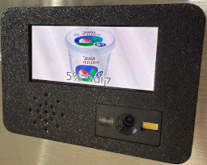

# ESPHome Projects

This repository holds some of the ESPHome-based projects I've developed.

The directory structure is as follows:
* In the root you will find all of the ESPHome YAML files for each projects
* 3D-printable cases, if applicable, can be found in the [3d](./3d) directory
  * This were written for OpenSCAD but generated STL files are included
  * Note that each STL file may include multiple objects, e.g., the top and bottom part of a case. Make sure to separate those in your slicer before slicing and printing
* The [doc](./doc) directory holds the build information for each project

## List of Projects

| Image | Description | Documentation |
| ----- |:----:|:----:|
|  | Barcode Scanner that automatically add items to groceries list while displaying an image of the product and calling out it's name | [Documentation](./doc/barcode_scanner#readme) |
