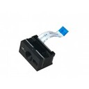
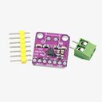
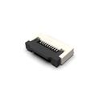
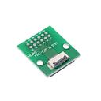
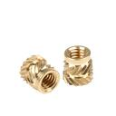
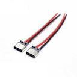
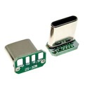
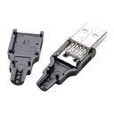
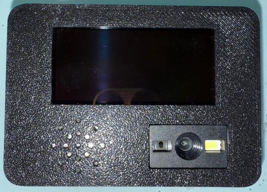
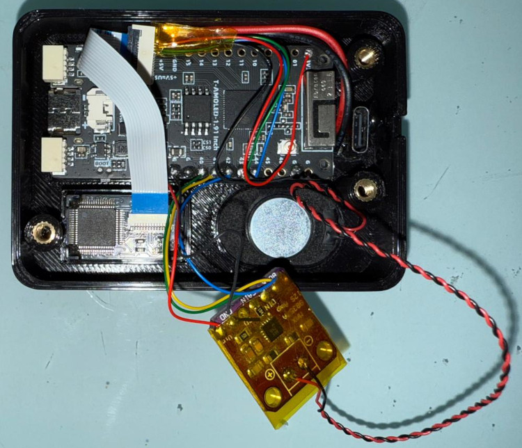

# Barcode Scanner

## Build

### Bill of Materials

| Name | Image | Quantity | Comments |
| ---- | ----- | -------- | -------- |
| LILYGO T-Display S3 AMOLED |  | 1 | v2.0, without touch screen nor soldered pins |
| GM65-S Barcode Scanner |  | 1 | |
| MAX98357 I2S Audio Amplifier Module |  | 1 | |
| Mini Oval Speaker|  | 1 | 24x15mm 8ohm 1w |
| Magnet |  | 2 | Only needed for mounting on, for example, a refrigerator |
| FFC connector / breakout board |  /  | 1 | 12p 0.5mm pitch |
| Threaded inserts |  | 3 | M3x5 |
| Countersunk screws |  | 3 | M3x8 |
| USB-C Female |  | 1 | Should be as short as possible. I resoldered the leads to point the other way so it would sit flush in the case |
| USB-C Male |  | 1 | Should be as short as possible |
| USB-A Male |  | 1 | Depending on power source |

## Connections

Barcode Scanner:
* Pin 2 (VCC) -> 3.3v
* Pin 3 (GND) -> GND
* Pin 4 (RX) -> GPIO 43
* Pin 5 (TX) -> GPIO 44

> [!TIP]
> You might also need, even if temporarily, to connect pin 12 of the scanner to set it up. See the [Barcode Scanner Setup](#barcode-scanner-setup) section for more information


MAX98357:
* LRC -> GPIO 42
* BCLK -> GPIO 41
* DIN -> GPIO 40
* GND -> GND
* VIN -> 3.3v

USB-C Female:
* Red -> 5V
* Black -> GND

## Images
| Front | Back |
| ----- | ---- |
|  |  |

## Home Assistant

* Place font file (e.g., `DejaVuSans.ttf`) in `/config`
* Place the [barcode_unknown.png](./barcode_unknown.png) image in `/config/www`

### Configuration

We need to make use of the following Home Assistant integrations for retrieving the product information and for generating the display image with the product name overlaid:

> [!NOTE]
> Change the font name of the shell command to match the chosen font file

```yaml
rest_command:
  product_from_barcode:
    url: "https://world.openfoodfacts.org/api/v2/product/{{ barcode }}?fields=brands,product_name,product_name_he,code,selected_images"
    timeout: 30

shell_command:
  barcode_image: ffmpeg -i {{ image_url }} -vf "scale=536:240:force_original_aspect_ratio=decrease,pad=536:240:x=(536-iw)/2:y=(240-ih)/2:color=white,drawtext=text='{{ caption | replace("'", "'\\\\\\\\\\\''") }}':fontfile=/config/DejaVuSans.ttf:x=(w-text_w)/2:y=(h-text_h):fontsize=48:fontcolor=black:borderw=1:bordercolor=white:expansion=none" -frames:v 1 -update 1 -y {{ destination }}
```

### Automation

The following automation will trigger when a barcode is detected and attempt to retrieve its information. If it succeeds, it'll create an image to display and use TTS to send the product name to the scanner. Finally, it'll add the product to your to-do list. If the product isn't detect and "unknown" image will be displayed and a notification sent.

> [!NOTE]
> The below automation prioritizes the Hebrew product names and images, be sure to change that, if needed.
>
> Change the `<HA IP>` place holder with the IP address / host name of your Home Assistant Instance.
>
> Change the to-do list and notify actions to match your setup.

```yaml
alias: Add item to shopping list
description: ""
triggers:
  - trigger: state
    entity_id:
      - sensor.barcode_scanner_barcode
conditions:
  - condition: not
    conditions:
      - condition: state
        entity_id: sensor.barcode_scanner_barcode
        state: unknown
      - condition: state
        entity_id: sensor.barcode_scanner_barcode
        state: unavailable
actions:
  - variables:
      barcode: |
        {{ states('sensor.barcode_scanner_barcode') }}
  - action: rest_command.product_from_barcode
    data:
      barcode: "{{ barcode }}"
    response_variable: barcode_response
  - if:
      - condition: template
        value_template: >-
          {{ barcode_response['status'] == 200 and
          barcode_response['content']['product'].get('product_name','') != ''
          and barcode_response['content']['product'].get('selected_images') !=
          None }}
    then:
      - variables:
          product_name: >
            {{ barcode_response['content']['product']['product_name_he'] if
            barcode_response['content']['product'].get('product_name_he', '') !=
            '' else barcode_response['content']['product']['product_name'] }}
          product_brand: >
            {{ barcode_response['content']['product'].get('brands',
            '').split(',')[0] }}
          product_image: >
            {{
            barcode_response['content']['product']['selected_images']['front']['display']['he']
            if
            barcode_response['content']['product']['selected_images']['front']['display'].get('he')
            != None else
            barcode_response['content']['product']['selected_images']['front']['display']['en']
            }}
          product_full_name: |
            {{ product_name }} {{ product_brand }}
      - action: shell_command.barcode_image
        data:
          image_url: "{{ product_image }}"
          caption: "{{ product_name }}"
          destination: /config/www/barcode_product.png
      - action: text.set_value
        metadata: {}
        data:
          value: >-
            http://<HA IP>:8123/local/barcode_product.png?random={{
            as_timestamp(now()) | int }}
        target:
          entity_id: text.barcode_scanner_product_image_url
        enabled: true
      - action: tts.speak
        metadata: {}
        data:
          cache: true
          media_player_entity_id: media_player.barcode_scanner_media_player
          message: "{{ product_full_name }}"
          options:
            voice: he-IL-HilaNeural
        target:
          entity_id: tts.azure_ai_speech
      - if:
          - condition: template
            value_template: >-
              {{ product_full_name not in state_attr('todo.groceries_list',
              'all_todos') | map(attribute='subject') | list }}
        then:
          - action: todo.add_item
            metadata: {}
            data:
              item: "{{ product_full_name }}"
            target:
              entity_id: todo.groceries_list
          - action: notify.someone
            data:
              message: "{{ product_full_name }} was added to the groceries list"
    else:
      - action: text.set_value
        metadata: {}
        data:
          value: >-
            http://<HA IP>:8123/local/barcode_unknown.png?random={{
            as_timestamp(now()) | int }}
        target:
          entity_id: text.barcode_scanner_product_image_url
        enabled: true
      - action: notify.someone
        data:
          message: "Unknown barcode was scanned: {{ barcode }}"
mode: single
```

## Misc

### Barcode Scanner Setup

To simplify the project, I've opted to set the scanner to work in continuous mode without waiting between attempts. Look for the GM65-S manual online and you'll find QR codes you can scan to configure the device it self. Note that you'll need to trigger the scanner at least once to set it to continuous mode.  This is done by pulling pin 12 to low.

### Beep Sound

The common cash register sound is a 860 Hz square wave. I created a similar one (sine wave) with FFmpeg:

```shell
ffmpeg -f lavfi -i "sine=frequency=860:sample_rate=16000:duration=0.2" -ac 1 -af "volume=20dB" -sample_fmt s16 -c:a flac -y sounds/beep_of_a_cash_register.flac
```

### Open Food Facts Proxy

Sometimes Open Food Fact's website is a bit slow to respond. If you find that's the case often, you might want to consider adding a caching reverse-proxy. The following nginx configuration seems to work:

```nginx
http {
    proxy_cache_path  /cache levels=1:2 keys_zone=my-cache:8m max_size=1000m inactive=1y;
    proxy_temp_path /cache/tmp;

    server {
        listen 8081;
        listen [::]:8081;

        location / {
            proxy_pass https://world.openfoodfacts.org;
            proxy_cache my-cache;
            proxy_cache_valid 1y;
            proxy_cache_bypass $http_invalidate_cache;
        }
    }
}
```
