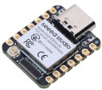
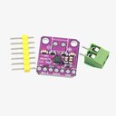
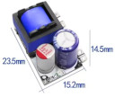
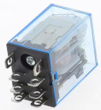
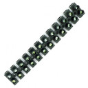
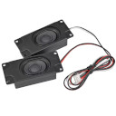
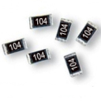
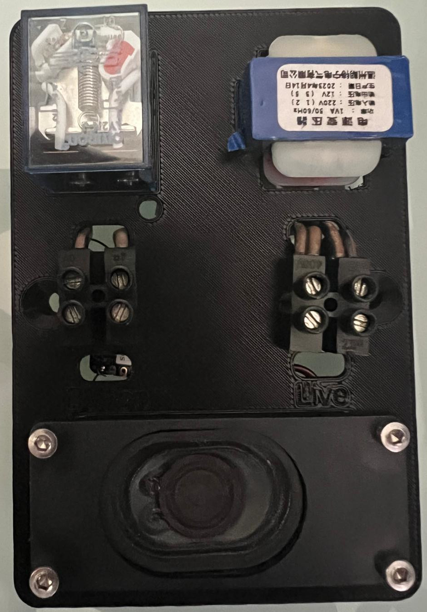
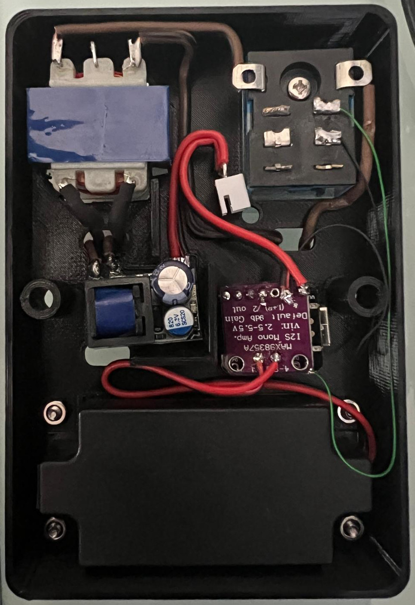

# Doorbell

This project is meant as a drop-in replacement to my existing doorbell buzzer. It uses the same infrastructure and illuminated push-button for activating it.

## Build

### Bill of Materials

| Name | Image | Quantity | Comments |
| ---- | ----- | -------- | -------- |
| SeeedStudio XIAO ESP32S3 |   | 1 | |
| MAX98357 I2S Audio Amplifier Module |  | 1 | |
| Transformer |  | 1 | 220v -> 12v |
| AC-DC Power supply |  | 1 | 5v |
| AC Relay |  | 1 | 12v AC |
| Terminal block |  | 4 | Split to two pairs |
| Speaker |  | 1 | 4 Ohm, 3W |
| 100k resistor |  | 1 | Optional, set's the Amplifier to 15dB gain instead of 9dB |
| M3x10 bolts and nuts |  | 4 | |

## Connections

MAX98357:
* LRC -> GPIO 44
* BCLK -> GPIO 7
* DIN -> GPIO 8
* Gain -> 100K resistor, the other end of the resistor to GND
* GND -> GND
* VIN -> 3.3v

Speaker:
* Red -> MAX98357 +
* Black -> MAX98357 -

Transformer:
* Primary (side with 2 pins) -> Live (AC) terminal block
* Secondary side -> One pin to the relay input and another to the button terminal block

Relay:
* Coil -> One side to the transformer, the other to the button terminal block
* Top contact (closer to the coil) -> GPIO 1
* Middle contact -> GND

AC-DC power supply:
* Mains -> Live (AC) terminal block
* 5v -> Xiao 5v
* GND -> GND

Live terminal block:
* AC Phase and neutral

Button terminal block:
* 2 leads to the illuminated doorbell push button

## Images
| Front | Back |
| ----- | ---- |
|  |  |

## Misc

### Media Player

The doorbell also functions as a Home Assistant media player meaning you can play any supported audio on it, as well as use text-to-speech actions on it for various notifications.

### MQTT

While Home Assistant already enumerates the button for automations and such, I also opted to enable MQTT so that other services, e.g., Scrypted, can get events when the doorbell is pressed. The topic for the button is `doorbell/binary_sensor/button/state` with a payload of `ON` or `OFF`.
